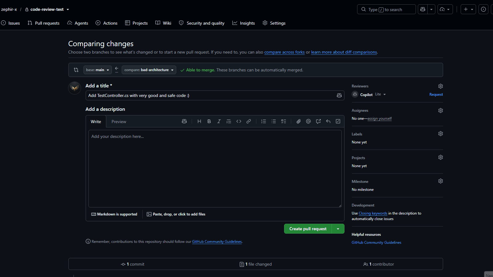
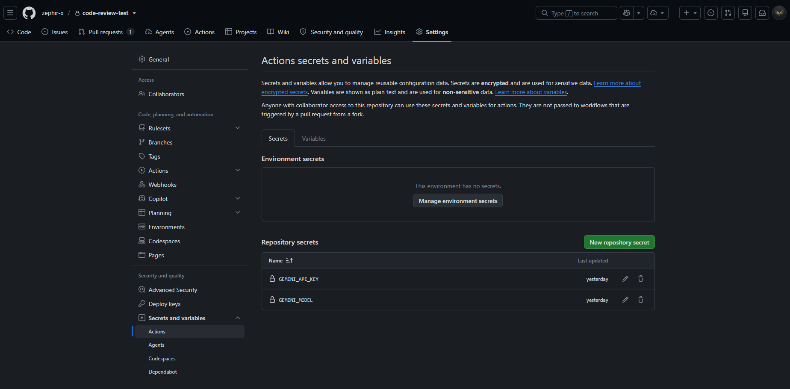
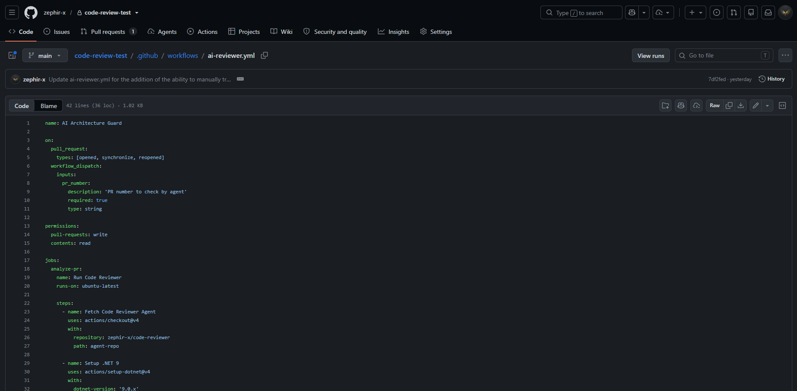
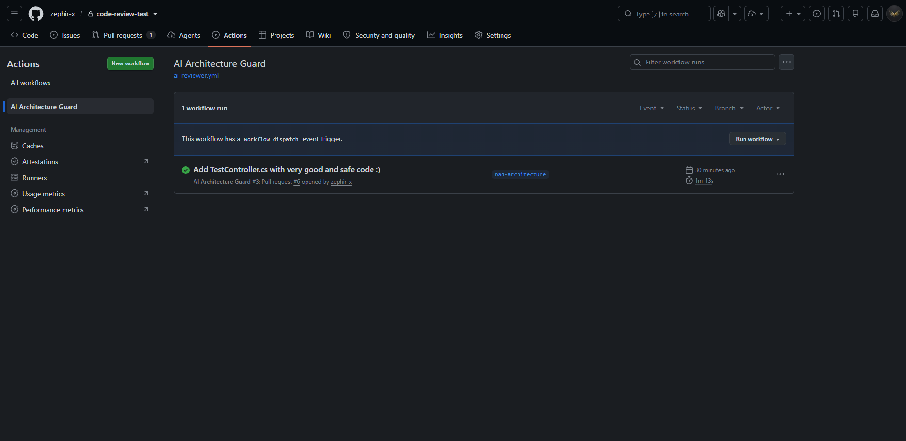

<div>

# 🛡️ AI Architecture Guard (Code Reviewer Agent)

[](https://dotnet.microsoft.com/)
[](https://docs.microsoft.com/en-us/dotnet/csharp/)
[](https://github.com/features/actions)
[](https://ai.google.dev/)
[](https://github.com/octokit/octokit.net)

*An autonomous, cloud-native CI/CD agent that acts as a strict Senior .NET Architect, reviewing your Pull Requests in real-time using Generative AI.*

</div>

---

<details>
<summary>📖 Table of Contents</summary>

- [About the Project](#-about-the-project)
- [Key Features & Architectural Marvels](#-key-features--architectural-marvels)
- [Algorithm Data Flow](#-algorithm-data-flow)
- [Technology Stack](#-technology-stack)
- [Prompt Engineering / Customization](#-prompt-engineering--customization)
- [Integration Guide (Cloud CI/CD)](#-integration-guide-cloud-cicd)
- [Getting Started (Local Development)](#-getting-started-local-development)
- [Author / Contact](#-author--contact)

</details>

---

## 💡 About the Project

**AI Architecture Guard** is not just a simple script that pastes ChatGPT responses into a GitHub thread. It is a highly robust, environment-agnostic `.NET 9` console application designed to run inside GitHub Actions runners.

It intercepts Pull Requests, fetches the precise `git diff`, and leverages the **Google Gemini LLM** to analyze the code for Clean Architecture violations, SOLID principles, security flaws (like hardcoded secrets or SQL injections), and performance bottlenecks. Finally, it uses the GitHub API (`Octokit`) to map the AI's findings back to specific lines of code, posting native **Inline Review Comments** just like a real human Senior Developer would.

---

<div>
  
  <p><i>🤖 The agent catching a severe SQL Injection and Clean Architecture violation in a PR.</i></p>
</div>

---

## 🏗️ Key Features & Architectural Marvels

This tool was engineered with distributed systems and CI/CD best practices in mind, tackling the common pitfalls of third-party API integrations:

* **🛡️ Ironclad Resiliency (Polly):** LLM APIs are notorious for throwing HTTP 503 (Service Unavailable) or timing out during high demand. The agent utilizes `Microsoft.Extensions.Http.Resilience` to implement a sophisticated **Exponential Backoff** and **Circuit Breaker** strategy, gracefully retrying requests without failing your CI/CD pipeline.
* **♻️ Idempotency Engine:** Running the workflow multiple times on the same PR? No problem. The agent fetches all existing comments before publishing and checks for duplicates. It will never spam your PR with the same warning twice.
* **🎯 Native Inline Comments:** Instead of dumping a massive wall of text at the bottom of a PR, the agent parses hunk headers (`@@ -x,y +z,w @@`) to map the AI's JSON output directly to the exact modified line via the GitHub API (`PullRequestReviewCommentCreate`).
* **🛑 Fail-Fast Design:** Environment variables are strictly validated on startup. If context is missing, the application safely crashes (`ExitCode = 1`) immediately, halting the GitHub Action and providing clear diagnostic logs.
* **☁️ Environment-Agnostic:** The codebase contains **zero hardcoded repository details**. It reads the context dynamically via `GITHUB_REPOSITORY` and `PR_NUMBER` variables injected by the GitHub runner, making it a universal plug-and-play tool.

---

## 🔄 Algorithm Data Flow

The architecture follows a strict "Tool Provider" pattern. Your target repository dynamically clones this agent and executes it within its own runner.

```mermaid
sequenceDiagram
    participant Dev as Developer
    participant TargetRepo as Target Repository
    participant Action as GitHub Actions
    participant Agent as Agent (.NET 9)
    participant Gemini as Google Gemini API
    
    Dev->>TargetRepo: Opens/Updates Pull Request
    TargetRepo->>Action: Triggers Workflow
    Action->>Action: Checks out target code
    Action->>Action: Fetches Code Reviewer Agent repo
    Action->>Agent: `dotnet run` (Injects Secrets & Env)
    
    rect rgb(30, 30, 30)
    Note over Agent,Gemini: Core Processing Pipeline
    Agent->>TargetRepo: Fetch PR Diff (Octokit)
    Agent->>Gemini: POST diff + Strict System Prompt
    Gemini-->>Agent: Returns JSON (CodeIssue mapping)
    Agent->>TargetRepo: Fetch existing PR comments
    Agent->>Agent: Filter out duplicates (Idempotency)
    Agent->>TargetRepo: Publish Native Inline Comments
    end
    
    Action-->>TargetRepo: Workflow Success / Failure
```



---

## 💻 Technology Stack

| Layer | Technologies & Tools |
| :--- | :--- |
| **Core Framework** | .NET 9, C# 13, Generic Host (Dependency Injection) |
| **AI Integration** | Google Gemini API (Strict JSON schema generation) |
| **GitHub API** | Octokit.NET (Diff fetching, Inline Commenting) |
| **Resilience** | Polly v8 (StandardResilienceHandler, Circuit Breaker) |
| **CI/CD** | GitHub Actions (Reusable workflow patterns, Dogfooding) |

---

## 🧠 Prompt Engineering / Customization

Every development team has its own rules and standards. One project might rely on *Clean Architecture*, another on a simple *three-tier* approach, while a third might require specific patterns like *MediatR*.

You can easily customize the rules guiding the AI by modifying the **System Prompt**. It is located in the file:
👉 **[GeminiAiEvaluator.cs](Services/GeminiAiEvaluator.cs)** (the `SystemPrompt` constant).

By adding your own rules there (e.g., *"Our team always uses FluentValidation for DTOs"*), you ensure the agent enforces them during every code review.

---

## ☁️ Integration Guide (Cloud CI/CD)

The agent is designed to be **Zero-Touch** for the host repository. You can plug it into any existing project in 2 simple steps:

### 1. Add Secrets
Go to your target repository's settings: **Settings -> Secrets and variables -> Actions -> Repository secrets** and add:
*   `GEMINI_API_KEY` - Your API Key from Google AI Studio.
*   `GEMINI_MODEL` - The model you wish to use (e.g., `gemini-3.6-flash`).

<div>
  
  <p><i>Exact location of the secrets you have to provide.</i></p>
</div>

### 2. Create the Workflow File
In your target repository, create a file at `.github/workflows/code-review.yml` and paste the following template:

```yaml
name: AI Architecture Guard

on:
  pull_request:
    types: [opened, synchronize, reopened]
  workflow_dispatch: # Allows manual triggering from the Actions tab
    inputs:
      pr_number:
        description: 'Target Pull Request Number'
        required: true
        type: string

permissions:
  pull-requests: write # Required to post review comments
  contents: read

jobs:
  analyze-pr:
    name: Run Code Reviewer
    runs-on: ubuntu-latest
    
    steps:
      # Step 1: Fetch the Agent's source code
      - name: Fetch Code Reviewer Agent
        uses: actions/checkout@v4
        with:
          repository: zephir-x/code-reviewer # Pointing to the tool provider
          path: agent-repo

      # Step 2: Setup .NET
      - name: Setup .NET 9
        uses: actions/setup-dotnet@v4
        with:
          dotnet-version: '9.0.x'

      # Step 3: Run the Agent
      - name: Execute Analysis
        working-directory: ./agent-repo
        run: dotnet run
        env:
          DOTNET_ENVIRONMENT: Production
          GitHub__Token: ${{ secrets.GITHUB_TOKEN }} # Auto-generated by GitHub
          Gemini__ApiKey: ${{ secrets.GEMINI_API_KEY }}
          Gemini__Model: ${{ secrets.GEMINI_MODEL }}
          # Fallback logic for manual vs automatic triggers
          PR_NUMBER: ${{ github.event.pull_request.number || inputs.pr_number }}
```

<div>
  
  <p><i>Location of the yml file in my test project.</i></p>
</div>

---

**That's it! Every new PR will now be autonomously reviewed by your personalized AI Senior Architect.**

<div>
  
  <p><i>Location for workflows activation and logs.</i></p>
</div>

---

## 🛠️ Getting Started (Local Development)

If you wish to fork this project and adjust the AI prompts or core logic, you can easily run and debug it locally.

### 1. Clone the repository:
```bash
git clone https://github.com/zephir-x/code-reviewer.git
cd code-reviewer
```

### 2. Configure Environment:
Copy `appsettings.Example.json` to `appsettings.Development.json` and fill in the blanks:
*   Add your **Personal Access Token (PAT)**.
    > 💡 **Tip:** You can generate it at [GitHub Settings (Tokens)](https://github.com/settings/tokens). Ensure you select the **'repo'** scope so the agent can read diffs and post comments.
*   Add your **Gemini API Key**.
*   Set the **TargetRepository** (Owner, Name, and an existing PR number to test against).

> **Important:** Ensure that your `appsettings.json` (and Development version) has the `<CopyToOutputDirectory>` set to `PreserveNewest` in your `.csproj` file, otherwise the app won't find the configuration:
> ```xml
> <None Update="appsettings*.json">
>   <CopyToOutputDirectory>PreserveNewest</CopyToOutputDirectory>
> </None>
> ```

> **Note:** `appsettings.Development.json` is safely .gitignored.

### 3. Run the Agent:
```bash
dotnet run
```
The application will automatically detect that it's running outside of GitHub Actions and fallback to your local configuration.

---

## 👨‍💻 Author / Contact

Engineered with ☕ and architectural rigor by **Kacper**.

[](https://www.linkedin.com/in/kacper-gumulak-dev)
